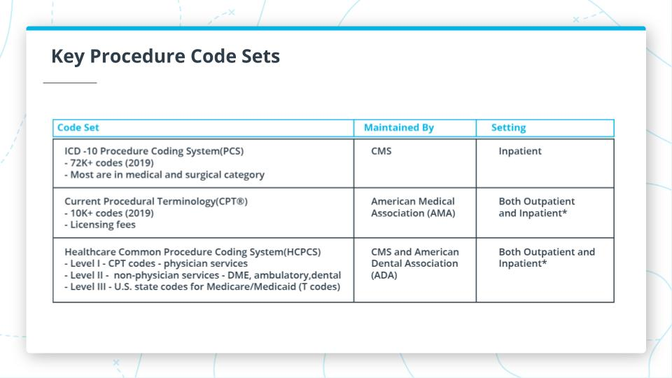

### AI-for-HealthCare
Note: when choosing a medical imaging problem to be solved by machine learning, it is tempting to assume that automated detection of certain conditions would be the most valuable thing to solve. However, this is not usually the case. Quite often detecting if a condition is present is not so difficult for a human observer who is already looking for such a condition. Things that bring most value usually lie in the area of productivity increase. Helping prioritize the more important exams, helping focus the attention of a human reader on small things or speed up tedious tasks usually is much more valuable. Therefore it is important to understand the clinical use case that the algorithm will be used well and think of end-user value first.

### 50 Surprising Statistics Every Healthcare Stakeholder Must Know
1. [50 Surprising Statistics Every Healthcare Stakeholder Must Know](https://www.osplabs.com/insights/50-surprising-statistics-every-healthcare-stakeholder-must-know/)

## Inspiration from Weina
2. [Weina Jin, M.D.](https://scholar.google.com/citations?user=uajp-AkAAAAJ&hl=en)
3. [About Weina](https://weina.me/)

### 2D medical Imaging 
1. [FDA cleared AI medical products that are related to radiology and other imaging domains](https://aicentral.acrdsi.org/)
2. [The Cancer Imaging Archive](https://www.acrdsi.org/DSI-Services/Define-AI/Use-Cases/Kidney-Stone-Detection-on-CT)
3. [TigerLily: Finding drug interactions in silico with the Graph](https://arxiv.org/pdf/2204.08206.pdf)
4. [TigerLily: Finding drug interactions in silico with the Graph](https://github.com/benedekrozemberczki/tigerlily)
- How it fits into medicine and the healthcare system.
- How to use AI to solve 2D Imaging problems 
- How to take AI from the bench to bedside to be used by doctors to improve patient lives

## Tutorial
1. [tutorial](https://tatwan.github.io/blog/jupyter/dicom/python/tensorflow/eda/2020/05/21/part-2-train-model-DICOM.html)
2. [Anather tutorial](https://livingdatalab.com/)
3. [Tutorial](https://ohif.org/examples)
4. [Tutoria](http://braintumorsegmentation.org/)

#### New terms
- **X-ray:** a 2D imaging technique that projects a type of radiation called x-rays down at the body from a single direction to capture a single image.
- Ultrasound: a 2D imaging technique that uses high-frequency sound waves to generate images.
- Computed Tomography (CT): a 3D imaging technique that emits x-rays from many different angles around the human body to capture more detail from more different angles.
- Magnetic Resonance Imaging (MRI): a 3D imaging technique that uses strong magnetic fields and radio waves to create images of areas of the body from all different angles.
- 2D imaging: an imaging technique that pictures are taken from a single angle.
- 3D imaging: an imaging technique that pictures are taken from different angles to create a volume of images.

##### Medical Imaging Workflow
- Picture Archiving and Communication System (PACS)
  * Every Imaging center and hospital have PACS. These systems allows for all medical imaging to be stored in the hospital's servers and transferred to different departments  throughout the hospital.
- Diagnostic Imaging 
  * In diagnostic situations, a clinitian orders an imaging study because they believe that a disease may be present based on the patient's symptoms. Diagnostic imaging can be performed in emergency settings as well as non-emergency settings.
    - Clinical believes something is wrong with the patient 
    - Need imaging to verify
    - e.g diagnosing brain tumor
- Screening
Screening studies are performed on populations of individuals who fall into risk groups for certain diseases. These tend to be diseases that are relatively common, have serious consequences, but also have the potential of being reversed if detected and treated early. For example, individuals who are above a certain age with a long smoking history are candidates for lung cancer screening which is performed using x-rays on an annual basis.
  * Nothing acutely wrong with the patient 
  * Patient in risk group for particular diseases
  * Imaging regularly for early detection
  * e.g regular screening for colonscopies because of family history.
 
 
 ### Application of Algorithms 
 * Track progression growth of tumour overtime -> Segmentation 
 * Identify the area of the lung where the fluid is -> Localization
 * Determine whether a tumor is malignant or benign -> Classification 
 
 ## key points
 * Model
 * Heuristic
 * Bernoul Distribution
 * Prior
 * Likelihood
 * Evidence
 * Posterior
 * Vocabulary 
 * Laplace Smoothing
 * Tokenization
 * Featurization
 * Lemmatization
 * Stemming 
 * Stop Word
 * Vectorizer
   Used in a step featurizing. It transforms some input into something else. One example is binary vectorizer which transforms tokenized messages into a binary vector indicating which items in the vocabulary appear in the message
 * Featurization
    The processin of transforming raw inputs into somethinga model can perform training and prediction on.
    
  ## Key stake holders
  
  #### Clinical Stakeholders
  Clinical stakeholders are radiologists, diagnosing clinicians and patients. Radiologists are likely the end-users of an AI application for 2D imaging. They care about low disruption to workflow and they play an important advisory role in the algorithm development process. Clinicians have less visibility into the inner workings of an algorithm. They also care about low disruption to workflows and they care about the interpretability of algorithm output.
  
  #### Industry Stakeholders
  Industry stakeholders include medical device companies, software companies, and hospitals. Many medical device companies typically have accompanying imaging software
  
  #### Regulatory Stakeholders
  
  The main regulatory stakeholder in the medical imaging world is the Food and Drug Administration (FDA). The FDA treats AI algorithms as medical devices. Medical devices are broken down into three classes by the FDA, Class I, Class II, and Class III, based on their potential risks present to the patient. A device's class dictates the safety controls, which in turn dictates which regulatory pathway they must go down. The two main regulatory pathways for medical devices are 510(k) and Pre-market Approval (PMA). Lower risk devices (Classes I & II) usually take a 501(k) submission pathway. Higher risk devices and algorithms (Class III) must go through PMA.
  
  
  ## Note!
  The patient is always a stakeholder when we are developing algorithms to read clinical imaging studies.

This tool will presumably help a radiologist to more accurately define the boundaries of a nodule and how they change over time, meaning it will part of the radiologist's workflow and therefore they are a stakeholder.

The software developer who creates this algorithm will be a key stakeholder as they will be responsible for describing the algorithm to the FDA.

The hospital will likely be the purchaser of your algorithm, and they are a key stakeholder in that the algorithm must be beneficial to them financially in order to be adopted into their radiology practice.
 
 
 
  
## Glossary
* **X-Ray:** Type of 2D imaging that uses a type of radiation to take pictures of the body's internal structures.
* **Computed Tomography:** Type of 3D imaging that uses x-rays to take pictures at multiple angles of the body's internal structures.
* **Magnetic Resonance Imaging:** Type of 3D imaging that uses radio waves and strong magnetic fields at multiple angles to take pictures of the body's internal structures
* **Mammogram:** A type of 2D x-ray that is specialized for breast imaging
* **Digital Pathology:** A type of 2D imaging that involves the digitization of microscopy images of cell-level biological material
* **Radiologist:** A specialized type of clinician who is trained to read medical imaging data
* **PACS:** Picture archiving and communication system, used for storing and viewing medical images within and across hospitals
* **Screening:** A type of test that is performed on individuals who are in a risk group for a given disease
* **Sensitivity:** Proportion of accurately identified positive cases that a test returns
* **Specificity:** Proportion of accurately identified negative cases that a test returns


### Medical Image Exploratory Data Analysis
#### DICOM
DICOM "Digital Imaging and Communications in Medicine", which is the standard for the communication and management of medical imaging information and related data.
* DICOM ensures the "interoperability" of medical imaging systems by making it easier to perform the following actions on medical images:
  * Produce, Store, Display, Send, Query, Process, Retrieve, Print
* By using DICOM, one can get derived structured documents and manage the related workflow more conveniently.
* DICOM files are a medical imaging file that is in the format that conforms to the DICOM standard.
* A DICOM file contains information about the imaging acquisition method, the actual medical images, and patient information. It has a header component that contains information about the acquired image and an image component that is a set of pixel data representing the actual images
* Protected Health Information (PHI) is part of DICOM and clinical data and radiologist report are not part of DICOM
* DICOM studies and series
With 2D imaging, a single 2D image is known as a single DICOM series. All image series combined comprise a study of the patient, known as a DICOM study.


For efficient algorithm training, the best practice is to pre-extract all data from DICOM headers into a dataframe.

DICOM header has some other applications besides training models. It can be used to mitigate the risks of the algorithm. It can also be used to optimize image processing workflow.

### **Summary**
    Some metadata may come from the DICOM headers, patient history, and image labels. Once we have all of a dataset's metadata stored in a single place, we'll then want to explore data features.

#### **Histograms**
    Histograms help us look at distributions of single variables. Sometimes we only want to look at distributions within a single class of our data.

#### **Scatterplots**
     Scatterplots are useful for assessing relationships between two variables.

#### **Pearson Correlation Coefficient**
    Pearson Correlation Coefficient measures how two variables are linearly related. The value ranges from -1 to 1. A value of 1 or -1 means the two variables are perfectly linearly related. A value of 0 implies there is no linear relationship between the two variables.

####  **Co-Occurrence Matrices**
    Co-Occurrence Matrices are useful for assessing how frequently different classifications co-occur together.

Not all 2D medical images are stored as a DICOM. Microscopy images are not stored in DICOM since they do not come from a digital machine. Instead, they are biological data and come from smeared physical cells from patients.

The first step of transforming microscopy into a digital image is to get the cell sample from a patient. Then cells are dyed into different colors based on their structure and viewed by a microscope. The microscopy data is then captured by a camera to form a digital image. This transformation technique is called digital pathology.

Once images are digitized, they can be processed with ML in the same way as you would with the pixel data extracted from DICOM.

### Glossary
#### **DICOM:** 
     Digital Imaging and Communications in Medicine (DICOM) is the standard for the communication and management of medical imaging information and related data
#### **Image artifact:** 
    An object or distortion in an image that reduces its quality
### **Foreign body:**
    An object in a medical image that is not biological material from the patient, such as a pacemaker or wire
### **Metadata:**
    A set of data that describes another set of data
### **Pathologist:**
    A special type of clinician who reads and interprets microscopy and digital pathology data
#### **intensity profile:**
    the distribution of all pixels' intensity values that comprise an image
### PHI:
   any individually identifiable health information, including demographic data, insurance information, and other information used to identify a patient
    
### ML vs. DL
The biggest difference between ML and DL is the concept of feature selection. Classical machine learning algorithms require predefined features in images. And, it takes up a lot of time and effort to design features. When deep learning came along, it was so groundbreaking because it worked to discover important features, taking this burden off of the algorithm researchers.

### Ostu's method
It’s often used for background extraction and classification. It takes the intensity distribution of an image and searches it to find the intensity threshold that minimizes the variance in each of the two classes. Once it discovers that threshold, it considers every pixel on one side of that image to be one class and on the other side to be another class.

### Convolutional neural network (CNN)
There are several sets of convolutional layers in a CNN model. Each layer is made up of a set of filters that are looking for features. Layers that come early in a CNN model look for very simple features such as directional lines and layers that come later look for complex features such as shapes.

Note that the input image size must match the size of the first set of convolutional layers.

### U-Net
U-Net is used for segmentation problems and it is more commonly used in 3D medical imaging. It's important to note that a limitation of 2D imaging is the inability to measure the volume of structures. 2D medical imaging only measures the area with respect to the angle of the image taken, which limits its utility in segmenting the whole area.


## Gold standard
The gold standard for a particular type of data refers to the method that detects disease with the highest sensitivity and accuracy. Any new method that is developed can be compared to this to determine its performance. The gold standard is different for different diseases.

## Ground truth
Often times, the gold standard is unattainable for an algorithm developer. So, you still need to establish the ground truth to compare your algorithm.

Ground truths can be created in many different ways. Typical sources of ground truth are

### Biopsy-based labeling. 
* Limitations: 
  difficult and expensive to obtain.
### NLP extraction. 
* Limitations: 
   may not be accurate.
### Expert (radiologist) labeling. 
* Limitations: 
  expensive and requires a lot of time to come up with labeling protocols.
### Labeling by another state-of-the-art algorithm. 
 * Limitations:
    may not be accurate.
## Silver standard
The silver standard involves hiring several radiologists to each make their own diagnosis of an image. The final diagnosis is then determined by a voting system across all of the radiologists’ labels for each image. Note, sometimes radiologists’ experience levels are taken into account and votes are weighted by years of experience.

## Intensity normalization
Intensity normalization is good practice and should always be done prior to using data for training. Making all of your intensity values fall within a small range that is close to zero helps the weights on our convolutional filters stay under control

## There are two types of normalization that you can perform.

* zero-meaning: subtract that mean intensity value from every pixel.
* standardization: subtract the mean from each pixel and divide by the image’s standard deviation.

### Image augmentation
Image augmentation allows us to create different versions of the original data. Keras provides ImageDataGenerator package for image augmentation.

## Note: 
not all image augmentation method is appropriate for medical imaging. A vertical flip should never be applied. And validation data should NEVER be augmented.

## Image resize
CNNs have an input layer that specifies the size of the image they can process. Keras flow_from_directory have a target_size parameter to resize image.

## Image Pre-processing

## GOALS:
* Remove potential noise from your images(e.g background extraction)
* Enforce some normalization across images(Zero-mean, standardization)
* Enlarge your dataset(Image Augmentation)
* Resize for your CNN architecture's required input

## Keras Image generator
```
ImageDataGenerator(rescale = 1. / 255)


```
function called flow_from_dataframe instead of flow_from_directory. This is easier because I had all of my image file paths stored in a dataframe, and is identical in function to flow_from_directory. This may be a handy tool in your project.

## Summary
#### Loss and loss function
Each time the entire training data is passed through the CNN, we call this one epoch. At the end of each epoch, the model has a loss function to calculate how different its prediction from the ground truth of the training image, this difference is the training loss. The network then uses the training loss to update the weights of filters. This technique is called back-propogation.

At the end of each epoch, we also use that loss function to evaluate the loss on the validation set and obtain a validation loss that measures how the prediction matches the validation data. But we don’t update weights using validation loss. The validation set is just to test the performance of the model.

If the loss is small, it means the model did well classifying the images that it saw in that epoch.

### Overfitting
If the training loss keeps going down while the validation loss stops decreasing after a few epochs, we call the model is overfitting. It suggests the model is still learning how to better classify the training data but NOT the validation data.

### Prevent overfitting
To avoid overfitting, we can A) changing your model’s architecture, or B) changing some of the parameters. Some parameters you can change are:

## Batch size
* Learning rate
* Dropout
* More variation on training data

## Glossary
* Training set: Set of data that your ML or DL model uses to learn its parameters, usually 80% of your entire dataset
* Validation set: Set of data that the algorithm developer uses to establish whether or not their algorithm is learning the correct features and parameters
* Gold standard: The method that detects your disease with the highest sensitivity and accuracy.
* Ground truth: A label used to compare against your algorithm's output and establish its performance
* Silver standard: A method to create a ground truth that takes into account several different label sources
* Image augmentation: The process of altering training data slightly to expand the training dataset
* Fine-tuning: The process of using an existing algorithm's architecture and weights created for a different task, and re-training them for a new task
* Batch size: The number of images used at a time to train an algorithm
* Epoch: A single run of sending the entire set of training data through an algorithm
* Learning rate: The speed at which your optimizer function moves towards a minimum by updating algorithm weights through back-propagation
* Overfitting: A phenomenon that happens when an algorithm specifically learns features of a training dataset that do not generalize beyond that specific dataset


## Intended use of the product
The FDA will require you to provide an intended use statement and an indication for use statement. The intended use statement tells the FDA exactly what your algorithm is used for. Not what it could be used for. And FDA will use this statement to define the risk and class of your algorithm.
* eg. In assisting the radiologist in detecting of breast abnormalities on mammogram 

## Indication for use of the product
You can use the indications for use statement to make more specific suggestions about how your algorithm could be used. Indications for use statement describes precise situations and reasons where and why you would use this device.
* eg. Screening mammography studies women between the ages of 20-60 yrs old with no prior history of breast cancer

## Algorithm limitations
When the FDA talks about limitations, they want to know more about scenarios where your algorithm is not safe and effective to use. In other words, they want to know where our algorithm will fail.

## Computational limitations
If your algorithm needs to work in an emergency workflow, you need to consider computational limitations and inform the FDA that the algorithm does not achieve fast performance in the absence of certain types of computational infrastructure. This would let your end consumers know if the device is right for them.

## Medical device reporting
After your algorithm is cleared by the FDA and released, the FDA has a system called Medical Device Reporting to continuously monitor. Any time one of your end-users discovers a malfunction in your software, they report this back to you, the manufacturer, and you are required to report it back to the FDA. Depending on the severity of the malfunction, and whether or not it is life-threatening, the FDA will either completely recall your device or require you to update its labeling and explicitly state new limitations that have been encountered.

## Precision
Precision looks at the number of positive cases accurately identified by an algorithm divided by all of the cases identified as positive by the algorithm no matter whether they are identified right or wrong. This metric is also commonly referred to as the positive predictive value.

## Precision and recall
A high precision test gives you more confidence that a positive test result is actually positive since a high precision test has low false positive. This metric, however, does not take false negatives into account. So a high precision test could still miss a lot of positive cases. Because of this, high-precision tests don’t necessarily make for great stand-alone diagnostics but are beneficial when you want to confirm a suspected diagnosis.

When a high recall test returns a negative result, you can be confident that the result is truly negative since a high recall test has low false negatives. Recall does not take false positives into account though, so you may have high recall but are still labeling a lot of negative cases as positive. Because of this, high recall tests are good for things like screening studies, where you want to make sure someone doesn’t have a disease or worklist prioritization where you want to make sure that people without the disease are being de-prioritized.

Optimizing one of these metrics usually comes at the expense of sacrificing the other.

## Threshold
CNN models output a probability ranging from 0-1 that indicates how likely the image belongs to a class. We will need a cut-off value called threshold to assist in making the decision if the probability is high enough to belong to one class. Recall and precision vary when a different threshold is chosen.


## Precision-recall curve
Precision-recall curve plots recall in the x-axis and precision in the y-axis. Each point along the curve represents precision and recall under a different threshold value.

## F1 score
For binary classification problems, the F1 score combines both precision and recall. F1 score allows us to better measure a test’s accuracy when there are class imbalances. Mathematically, it is the harmonic mean of precision and recall.

## FDA validation plan
### FDA validation set
You'll need to perform a standalone clinical assessment of your tool that uses an FDA validation set from a real-world clinical setting to prove to the FDA that your algorithm works. You will run this FDA validation set through your algorithm just ONCE.

You’ll need to identify a clinical partner who you can work with to gather the “BEST” data for your validation plan. This partner will collect data from a real-world clinical setting that you describe so that you can then see how your algorithm performs under these specifications.

### Collect the FDA validation set
You need to identify a clinical partner to gather the FDA validation set. First, you need to describe who you want the data from. Second, you need to specify what types of images you’re looking for.

### Establish the ground truth
You need to gather the ground truth that can be used to compare the model output tested on the FDA validation set. The choice of your ground truth method ties back to your intended use statement. Depending on the intended use of the algorithm, the ground truth can be very different.

### Performance standard
For your validation plan, you need evidence to support your reasoning. As a result, you need a performance standard. This step usually involves a lot of literature searching.

Depending on the use case for your algorithm, part of your validation plan may need to include assessing how fast your algorithm can read a study.

## Glossary
## Intended Use:
A statement given to the FDA that concisely describes what your algorithm does
## 510(k):
An FDA regulatory pathway for medical devices of all three risk categories that is appropriate when a predicate device exists
## PMA: 
An FDA regulatory pathway for Class II and III devices that is mandated when a predicate device does not exist

# 3D Medical Imaging
[tutorial](https://www.andreagiardina.com/3D-Medical-Images.html#orga323812)
### Imaging modality: 
    a device used to acquire a medical image
### MRI scanner:
    Magnetic Resonance Imaging scanner

## Contrast resolution    
Contrast resolution refers to the ability of any imaging modality to distinguish between differences in image intensity, and makes the most sense to optimize in this given scenario.

#### Contrast resolution: 
the ability of an imaging modality to distinguish between differences in image intensity
#### Spatial resolution: 
the ability of an imaging modality to differentiate between smaller objects

Surgeons, Interventional Radiologists, and other procedure-heavy fields use 3D medical imaging not only for diagnosis, but for guidance during an operation/procedure.

### K-space data:
“raw” data generated by an MRI scanner. Images need to be reconstructed from it

### Pulse sequence:
a combination of magnetic fields and sequence in which they are applied that results in a particular type of MR image

## MPR: 
multi-planar reconstruction - extraction of non-primary imaging planes from a 3D volume

### Creating a 2D image from k-space data
MRI Data construction


### Multi pluner reconstruction
Extracting a 2D image in coronal plane from an image which has been acquired in sagittal
extracting non-primary 2D planes from volume


### 3D reconstruction is creating a 3D image or from the 2D slices.
building 3D volume from voxels

### Windowing
Mapping the hing-range intensity space to 8-bit grayscale screen space

## Medical image registration
Bringing two images into the same patient-centric coordinate system so that they could be loverlaid on top of each other

Depending on the tasks you are dealing with, you might come across both registered and unregistered data in your datasets. Before starting to build models that leverage data for the same patient that comes from multiple modalities or multiple time points, you should think if your voxels match up in space or not. And if they don’t you might want to consider registering related volume pairs.

Vocabulary
Let us leave you with a little vocabulary of the many terms that have been introduced throughout this lesson:

##### Imaging modality: a device used to acquire a medical image
##### Contrast resolution: the ability of an imaging modality to distinguish between differences in image intensity
##### Spatial resolution: the ability of an imaging modality to differentiate between smaller objects
#### CT scanner: computed tomography scanner
##### Sinogram: “raw” data generated by CT scanner. Images need to be reconstructed from it
##### MRI scanner: Magnetic Resonance Imaging scanner
##### K-space data: “raw” data generated by an MRI scanner. Images need to be reconstructed from it
##### Windowing: mapping high dynamic range of medical images onto the screen-space gray color scale
##### MPR: multi-planar reconstruction - extraction of non-primary imaging planes from a 3D volume
##### 3D reconstruction: constructing a 3D model from multiple slices of 3D medical imaging data
##### Registration: bringing two different images into same patient-centric coordinate space


#### DICOM
Entity-Relationship Model
### DICOM 
standard defines Information Entities that represent various real-world entities and relationships between them. The cornerstone of the DICOM standard are the following objects and relationships:

### Patient 
is, naturally, the patient undergoing the imaging study. A patient object contains one or more studies.

### Study 
- a representation of a “medical study” performed on a patient. You can think of a study as a single visit to a hospital for the purpose of taking one or more images, usually within. A Study contains one or more series.

### Series 
- a representation of a single “acquisition sweep”. I.e., a CT scanner took multiple slices to compose a 3D image would be one image series. A set of MRI T1 images at different axial levels would also be called one image series. Series, among other things, consists of one or more instances.

### Instance 
- (or Image Information Entity instance) is an entity that represents a single scan, like a 2D image that is a result of filtered backprojection from CT or reconstruction at a given level for MR. Instances contain pixel data and metadata (Data Elements in DICOM lingo)

### NIFTI FILES
NIFTI, which stands for Neuroimaging Informatics Technology Initiative, is an open standard that is available at [link](https://nifti.nimh.nih.gov/nifti-2.) The standard has started out as a format to store neurological imaging data and has slowly seen a larger adoption across other types of biomedical imaging fields.

Some things that distinguish NIFTI from DICOM, though are:

- NIFTI is optimized to store serial data and thus can store entire image series (and even study) in a single file.
- NIFTI is not generated by scanners; therefore, it does not define nearly as many data elements as DICOM does. Compared to DICOM, there are barely any, and mostly they have to do with geometric aspects of the image. Therefore, NIFTI files by themselves can not constitute a valid patient record but could be used to optimize storage, alongside some sort of patient info database.
- NIFTI files have fields that define units of measurements and while DICOM files store all dimensions in mm, it’s always a good idea to check what units of measurement are used by NIFTI.
- When addressing voxels, DICOM uses a right-handed coordinate system for X, Y and Z axes, while NIFTI uses a left-handed coordinate system. Something to keep in mind, especially when mixing NIFTI and DICOM data.
- NIFTI’s ability to store entire series in a single file is quite convenient when you are dealing with a curated research dataset. Also, NIFTI uses a different orientation of the cartesian coordinate system than DICOM.

1. [NIFTI File](https://nifti.nimh.nih.gov/nifti-1/documentation/nifti1fields)
2. [good dicom](https://dicom.innolitics.com/ciods/ct-image/patient)
3. [nifti tutorial](https://nipy.org/nibabel/coordinate_systems.html)
4. [elements in DICOM’s ImagePixel module.](https://dicom.nema.org/medical/dicom/current/output/chtml/part03/sect_C.7.6.3.html#table_C.7-11c)

## Cancer Dataset sources
1. [Cancer Dataset sources](https://www.acrdsi.org/DSI-Services/Dataset-Directory)

### EDA Tutorial
1. [RSNA Intracranial Hemorrhage Detection Identify acute intracranial hemorrhage and its subtypes](https://www.kaggle.com/c/rsna-intracranial-hemorrhage-detection)
2. [RSNA Pneumonia Detection Challenge Can you build an algorithm that automatically detects potential pneumonia cases?](https://www.kaggle.com/c/rsna-pneumonia-detection-challenge)
3. [Data Science Bowl 2017 Can you improve lung cancer detection?](https://www.kaggle.com/c/data-science-bowl-2017)
4. [RSNA-ASNR-MICCAI Brain Tumor Segmentation (BraTS) Challenge 2021](http://braintumorsegmentation.org/)

### Notebooks and tricks
1. [windowing approaches](https://www.kaggle.com/code/jhoward/don-t-see-like-a-radiologist-fastai/notebook)
2. [See like a Radiologist with Systematic Windowing](https://www.kaggle.com/code/dcstang/see-like-a-radiologist-with-systematic-windowing/notebook)
3. [Some DICOM gotchas to be aware of (fastai)](https://www.kaggle.com/code/jhoward/some-dicom-gotchas-to-be-aware-of-fastai/notebook)


#### Vocabulary

 - Digital Imaging and Communication in Medicine. The standard defining the storage and communication of medical images.
 - DICOM Information Object - representation of a real-world object (such as an MRI scan) per DICOM standard.
 - IOD - Information Object Definition. Definition of an information object. Information Object Definition specifies what metadata fields have to be in place for a DICOM Information Object to be valid. IODs are published in the DICOM standard.
 - Patient - a subject undergoing the imaging study.
 - Study - a representation of a “medical study” performed on a patient. You can think of a study as a single visit to a hospital for the purpose of taking one or more images, usually within. A Study contains one or more series.
 - Series - a representation of a single “acquisition sweep”. I.e., a CT scanner took multiple slices to compose a 3D image would be one image series. A set of MRI T1 images at different axial levels would also be called one image series. Series, among other things, consists of one or more instances.
 - Instance - (or Image Information Entity instance) is an entity that represents a single scan, like a 2D image that is a result of filtered backprojection from CT or reconstruction at a given level for MR. Instances contain pixel data and metadata (Data Elements in DICOM lingo).
 - SOP - Service-Object Pair. DICOM standard defines the concept of an Information Object, which is the representation of a real-world persistent object, such as an MRI image (DICOM Information Objects consist of Information Entities).
 - Data Element - a DICOM metadata “field”, which is uniquely identified by a tuple of integer numbers called group id and element id.
 - VR - Value Representation. This is the data type of a DICOM data element.
 - Data Element Type - identifiers that are used by Information Object Definitions to specify if Data Elements are mandatory, conditional or optional.
 - NIFTI - Neuroimaging Informatics Technology Initiative, is an open standard that is used to store various biomedical data, including 3D images.

 

When it comes to classification and object detection problems, the key to solving those is identifying relevant features in the images, or feature extraction. Not so long ago, machine learning methods relied on manual feature design. With the advent of CNNs, feature extraction is done automatically by the network, and the job of a machine learning engineer is to define the general shape of such features. As the name implies, features in Convolutional Neural Networks take the shape of convolutions. In the next section, let’s take a closer look at some of the types of convolutions that are used for 3D medical image analysis.

### New Vocabulary
Classification - the problem of determining which one of several classes an image belongs to.
Object Detection - the problem of finding a (typically rectangular) region within an image that matches with one of several classes of interest.

#### 2D Convolution 
is an operation visualized in the image above, where a convolutional filter is applied to a single 2D image. Applying a 2D convolution approach to a 3D medical image would mean applying it to every single slice of the image. A neural network can be constructed to either process slices one at a time, or to stack such convolutions into a stack of 2D feature maps. Such an approach is fastest of all and uses least memory, but fails to use any information about the topology of the image in the 3rd dimension.

#### 2.5D Convolution 
is an approach where 2D convolutions are applied independently to areas around each voxel (either in neighboring planes or in orthogonal planes) and their results are summed up to form a 2D feature map. Such an approach leverages some 3-dimensional information.

#### 3D Convolution
is an approach where the convolutional kernel is 3 dimensional and thus combines information from all 3 dimensions into the feature map. This approach leverages the 3-dimensional nature of the image, but uses the most memory and compute resources.

Understanding these is essential to being able to put together efficient deep neural networks where convolutions together with downsampling are used to extract higher-order semantic features from the image.


### QUIZ QUESTION
Assuming that you keep input and output images in memory, what is the minimum amount of memory in bytes that you need to allocate in order to compute a convolutional feature map of size 28x28 from an image of size 30x30 using a 3x3 convolutional kernel? Assume 16 bits per pixel and 16 bits for each parameter of the kernel.

## Ans
3400 "Correct, you need to at least store the original image - 30x30x2 bytes, the output image - 28x28x2 bytes and the convolutional kernel - 4x4x2 bytes. Now, you can try and compute how this requirement changes for 2.5d and 3d approaches."


# Resources
1. [A guide to convolution arithmetic for deeplearning](https://arxiv.org/pdf/1603.07285.pdf)
2. [Improving Computer-aided Detection using Convolutional Neural Networks and Random View Aggregation](https://arxiv.org/pdf/1505.03046.pdf)
3. [A New 2.5D Representation for Lymph Node Detection using Random Sets of Deep Convolutional Neural Network Observations](https://www.ncbi.nlm.nih.gov/pmc/articles/PMC4295635/pdf/nihms654160.pdf)
4. [3D multi-view convolutional neural networks for lung nodule classification](https://journals.plos.org/plosone/article?id=10.1371/journal.pone.0188290)

### Segmentation

Segmentation - the problem of identifying which specific pixels within an image belong to a certain object of interest. 

- Longitudinal follow up:
 Measuring volumes of things and monitoring how they change over time. These methods are very valuable in, e.g., oncology for tracking slow-growing tumors.
- Quantifying disease severity: 
Quite often, it is possible to identify structures in the organism whose size correlates well with the progression of the disease. For example, the size of the hippocampus can tell clinicians about the progression of Alzheimer's disease.

- Radiation Therapy Planning: 
One of the methods of treating cancer is exposing the tumor to ionizing radiation. In order to target the radiation, an accurate plan has to be created first, and this plan requires careful delineation of all affected organs on a CT scan

- Novel Scenarios: 
Segmentation is a tedious process that is not quite often done in clinical practice. However, knowing the sizes and extents of the objects holds a lot of promise, especially when combined with other data types. Thus, the field of radiogenomics refers to the study of how the quantitative information obtained from radiological images can be combined with the genetic-molecular features of the organism to discover information not possible before.

### Quiz: Can you identify a use case for segmentation in this clinical task?
A certain part of the population has risk factors that make them susceptible to early lung cancer - these could be things like smoking, routine exposure to certain substances or family history. A combination of these risk factors make people good candidates for routine lung cancer screening since early detection can lead to very positive outcomes. Routine lung cancer screening is done by taking a low-dose CT image and then looking for dense areas in the lungs, or lung nodules. Quite often, if lung nodules are found, they need to be monitored to see how they grow as the presence of nodules per se does not necessarily mean that intervention is needed. Most important question a radiologist would need to answer - which nodules have increased in size since the last time a scan was taken?

Would a classification or segmentation algorithm be a good tool to assist the radiologist? Why?

### ANS

The segmentation algorithm would make the radiologists’ job much easier since measuring volume needs accurate delineation of the extent of the nodules. However, in a comprehensive AI system, a classification or object detection algorithm may also assist in the screening process, providing a second read of the image and flagging those where nodules are initially found.

#### Unet
1. [unet](https://lmb.informatik.uni-freiburg.de/people/ronneber/u-net/index.html)
2. [Brain Tumor Segmentation | UNets | PyTorch | Monai](https://www.kaggle.com/code/sudhupandey/brain-tumor-segmentation-unets-pytorch-monai)
3. [Brain MRI segmentation](https://www.kaggle.com/datasets/mateuszbuda/lgg-mri-segmentation)
4. [U-Net: Convolutional Networks for Biomedical Image Segmentation](https://arxiv.org/pdf/1505.04597.pdf)
5. [Medical Segmentation Decathlon Generalisable 3D Semantic Segmentation](http://medicaldecathlon.com/)
6. [notebook](https://github.com/udacity/nd320-c3-3d-med-imaging/tree/master/3d-imaging-end-to-end-deep-learning-applications/exercises/2-segmentation-hands-on/solution)

### Further Resources
1. [Upsampling](https://naokishibuya.medium.com/up-sampling-with-transposed-convolution-9ae4f2df52d0)
2. [Fully Convolutional Networksfor Semantic Segmentation](https://arxiv.org/pdf/1605.06211v1.pdf)
3. [Hounsfield](https://en.wikipedia.org/wiki/Hounsfield_scale)
4. [Radiogenomics: bridging imaging and genomics](https://link.springer.com/article/10.1007/s00261-019-02028-w)
5. [Ground Truth](https://www.ncbi.nlm.nih.gov/pmc/articles/PMC3587102/)
6. [Autosegmentation of prostate anatomy for radiation treatment planning using deep decision forests of radiomic features](https://www.researchgate.net/publication/328485616_Autosegmentation_of_prostate_anatomy_for_radiation_treatment_planning_using_deep_decision_forests_of_radiomic_features)
7. [Metrics for evaluating 3D medical image segmentation: analysis, selection, and tool](https://www.ncbi.nlm.nih.gov/pmc/articles/PMC4533825/)


#### QUIZ QUESTION
You're building a ML model to segment blood vessels in chest CT scans. Since blood vessels are only a few voxels in diameter, it's possible that the predicted shape might be very similar to ground truth but predicted voxels will not match GT precisely. Which of the following metrics would be best if you wanted to rate this type of prediction similarly to one that labels all the voxels precisely?

#### ANS
Hausdorff distance will assign similar scores to result that matches up with all the voxels and one where none of the voxels match up, but the structure is very close to the target.


### Resources
1. [Using deep learning to increase the resolution of low-res scans](https://www.ncbi.nlm.nih.gov/pmc/articles/PMC6107420/)
2. [GANs for synthetic MRI](https://arxiv.org/pdf/1803.01229.pdf)
3. [A survey of deep learning methods for medical image registration:](https://arxiv.org/abs/1903.02026)
4. [Overview of opportunities for deep learning on MRIs:](https://www.sciencedirect.com/science/article/pii/S0939388918301181)

### Tools and libraries
1. [Fast.ai - python library for medical image analysis, with focus on ML:](https://docs.fast.ai/medical.imaging.html)
2. [MedPy - a library for medical image processing with lots of various higher-order processing methods](https://pypi.org/project/MedPy/)
3. [Deepmedic, a library for 3D CNNs for medical image segmentation](https://github.com/deepmedic/deepmedic)
4. [A publication about a project dedicated to large-scale medical imaging ML model evaluation which includes a comprehensive overview of annotation tools and related problems (including inter-observer variability)](https://link.springer.com/chapter/10.1007/978-3-319-49644-3_4)
5.  ## Work by the German Cancer Research Institute
6. [a boilerplate for machine learning experiment](https://github.com/MIC-DKFZ/trixi)
7. [tooling for data augmentation](https://github.com/MIC-DKFZ/batchgenerators)

## Books
1. [deep learning with a special section on computer vision by Alexander Smola et al. Alexander has a strong history of publications on machine learning algorithms and statistical analysis and is presently serving as a director for machine learning at Amazon Web Services in Palo Alto, CA](https://d2l.ai/)
2. [a book on general concepts of machine learning by Christopher Bishop et al. Christopher has a distinguished career as a machine learning scientist and presently is in charge of Microsoft Research lab in Cambridge, UK, where I had the honor to work on project [InnerEye for several years](https://www.microsoft.com/en-us/research/project/medical-image-analysis/).](https://www.mbmlbook.com/)
3. [Interactive Organ Segmentation using Graph Cuts](https://cs.uwaterloo.ca/~yboykov/Papers/miccai00.pdf)
4. [Probabilistic Graphical Models for Medical Image Segmentation](https://www.researchgate.net/publication/280664591_Probabilistic_Graphical_Models_for_Medical_Image_Segmentation)
5. [Awesome Semantic Segmentation](https://github.com/mrgloom/awesome-semantic-segmentation)

##### There are two types of DICOM networking: DIMSE (DICOM Message Service Element) and DICOMWeb. 
The former is designed to support data exchange in protected clinical networks that are largely isolated from the Internet.
The latter is a set of RESTful APIs (link to the Standard) that are designed to communicate over the Internet. 
- DIMSE networking does not have a notion of authentication and is prevalent inside hospitals.
- DIMSE networking defines how DICOM Application Entities talk to each other on protected networks.
- DICOM Application Entities that talk to each other take on roles of Service Class Providers which are an an AE that provides services over DIMSE network and Service Class Users which is an AI that requests service from an SCP SCPs typical respond to requests and SCUs issue them
Full list of DIMSE services could be found in the Part 7 of the DICOM Standard, ones that you are most likely run into are:
- C-Echo - “DICOM ping” - checks if the other party can speak DICOM
- C-Store - request to store an instance
- An Application Entity (AE) is an actor on a network (e.g. a medical imaging modality or a PACS) that can talk DIMSE messages defined by three parameters:
- Port
- IP Address
- Application Entity Title (AET) - an alphanumeric string

### Clinical networking is an industry on its own and an AI engineer will probably be exposed to a very small subset of that. So, it’s important to understand the basics - what are the systems that are important to a clinical network and how do they all fit together.

### New Vocabulary
- PACS - Picture Archiving and Communication System. An archive for medical images. A PACS product typically also includes “diagnostic workstations” - software for radiologists that is used for viewing and reporting on medical images.
- VNA - Vendor Neutral Archive. A PACS that is not tied to a particular equipment manufacturer. A newer generation of PACS. Often deployed in a cloud environment.
- EHR - Electronic Health Record. A system that stores clinical and administrative information about the patients. If you’ve been to a doctor’s office where they would pull your information on a computer screen and type up the information - it is an EHR system that they are interacting with. EHR system typically interfaces with all other data systems in the hospital and serves as a hub for all patient information. You may also see the acronym “EMR”, which typically refers to the electronic medical records stored by the EHR systems.
- RIS - Radiology Information System. Think of those as “mini-EHRs” for radiology departments. These systems hold patient data, but they are primarily used to schedule patient visits and manage certain administrative tasks like ordering and billing. RIS typically interacts with both PACS and EHR.

#### In addition to DICOM protocol there are two more (among many) that you might run into:

- HL7 - Health Level 7. A protocol used to exchange patient data between systems as well as data about physician orders (lab tests, imaging exams)
- FHIR - Fast Healthcare Interoperability Resources. Another protocol for healthcare data exchange. HL7 dates back to the '80s and many design decisions of this protocol start showing their age. You can think of FHIR as the new generation of HL7 built for the open web.

### When you start thinking of deploying your AI algorithms, you will want to set some requirements as to data that is sent to these algorithms, and the environment they operate in. When defining those, you may want to think of the following:

Series selection. As we’ve seen, modalities typically use C-STORE requests to send entire studies. How are you going to identify images/series that your algorithms will process?
Imaging protocols. There are lots of ways images can be acquired - we’ve talked about MR pulse sequences, and there are just physiological parameters, like contrast media or FoV. How do you make sure that your algorithm processes images that are consistent with what it has been trained on?
Workflow disruptions. If the algorithm introduces something new into the radiologists' workflow - how is this interaction going to happen?
Interfaces with existing systems. If your algorithm produces an output - where does it go? What should the systems processing your algorithm’s output be capable of doing?

### Resources
1. [Digital Imaging and Communications in Medicine (DICOM)](https://link.springer.com/book/10.1007/978-3-642-10850-1)
2. [Understanding and Using DICOM, the Data Interchange Standard for Biomedical Imaging](https://www.ncbi.nlm.nih.gov/pmc/articles/PMC61235/)
3. [As usual, DICOM standard is a great reference for DICOM networking](https://dicom.nema.org/medical/dicom/2020a/output/chtml/part07/sect_7.5.html#sect_7.5.1)
4. [dcmtk tool](https://dcmtk.org/)


### Regulatory Landscape
#### FDA [MEDICAL DEVICE](https://www.fda.gov/medical-devices/classify-your-medical-device/how-determine-if-your-product-medical-device)
An instrument, apparatus, implement, machine, contrivance, implant, in vitro reagent, or other similar or related article, including a component part, or accessory which is:

1. recognized in the official National Formulary, or the United States Pharmacopoeia, or any supplement to them,
2. intended for use in the diagnosis of disease or other conditions, or in the cure, mitigation, treatment, or prevention of disease, in man or other animals, or
3. intended to affect the structure or any function of the body of man or other animals, and which does  not achieve its primary intended purposes through chemical action within or on the body of man or other animals …
4. [FDA Clearances](https://www.accessdata.fda.gov/scripts/cdrh/cfdocs/cfPMN/pmn.cfm)
5. [FDA Clearances](https://www.accessdata.fda.gov/cdrh_docs/pdf19/K192437.pdf)
6. [FDA quality management](https://www.accessdata.fda.gov/scripts/cdrh/cfdocs/cfCFR/CFRSearch.cfm?CFRPart=820)


#### [European Medical Device Regulation (MDR)](https://eur-lex.europa.eu/legal-content/EN/TXT/?uri=uriserv:OJ.L_.2017.117.01.0001.01.ENG&toc=OJ:L:2017:117:TOC)
‘medical device’ means any instrument, apparatus, appliance, software, implant, reagent, material or other article intended by the manufacturer to be used, alone or in combination, for human beings for one or more of the following specific medical purposes:

* diagnosis, prevention, monitoring, prediction, prognosis, treatment or alleviation of disease,
* diagnosis, monitoring, treatment, alleviation of, or compensation for, an injury or disability,
* investigation, replacement or modification of the anatomy or of a physiological or pathological process or state,
* providing information by means of in vitro examination of specimens derived from the human body, including organ, blood and tissue donations,
* [European and Canadian regulators require compliance](https://www.iso.org/standard/59752.html)

The pattern here - something that is built with the purpose of diagnosing, preventing, or treating the disease is potentially a medical device that should conform with certain standards of safety and engineering rigor. The degree of this rigor that the regulatory bodies require depends on the risk class of the said device. Thus, for a device with lesser risk class (like a sterile bandage) often it is sufficient to just notify the respective regulatory body that device is being launched into the market while with high-risk devices (like an implantable defibrillator) there are requirements to clinical testing and engineering practices.

While “medical device” may sound like something that does not have much to do with software, the regulatory bodies actually include software in this notion as well, often operating with concepts of “software-as-a-medical-device”. Sometimes a distinction is made between “medical device with embedded software” (like a CT scanner) or “software-only medical device” (like a PACS).

Key thing that determines whether something is a medical device or not, and what class it is, is its ”intended use”. The same device may have different risk classes (or not qualify as a medical device at all) depending on what use you have in mind for it. A key takeaway here is that the presence of an “AI algorithm” in a system that is used by clinicians does not automatically make it a medical device. You need to articulate the intended use of the system before you try to find out what the regulatory situation is for your product.


- HIPAA - Health Insurance Portability and Accountability Act - key legislation in the USA that among other things defines the concept of Protected Health Information and rules around handling it.
- GDPR - General Data Protection Regulation - European legislation that defines the principles of handling personal data, including health data.

[ANONYMIZING DICOM](https://github.com/udacity/nd320-c3-3d-med-imaging/blob/master/deploy-algorithms-in-real-world/exercises/3-anonymization/solution/Anonymization.ipynb)


## Further resources 
1. [FDA’s guidance for software validation](https://www.fda.gov/media/73141/download)
2. [webinars on all things medical](https://www.acr.org/Member-Resources/rfs/Journal-Club)
3. [Article by American Collage of Radiology](https://www.acadrad.org/wp-content/uploads/2019/06/NIBIB-workshop-1.pdf)
4. [Proposed Regulatory Framework for Modifications to Artificial Intelligence/Machine learning(AI/ML) Based Software as a Medical Device](https://www.fda.gov/media/122535/download)


### Vocabulary
* PACS - Picture Archiving and Communication System. An archive for medical images. A PACS product typically also includes “diagnostic workstations” - software for radiologists that is used for viewing and reporting on medical images.
* VNA - Vendor Neutral Archive. A PACS that is not tied to a particular equipment manufacturer. A newer generation of PACS. Often deployed in a cloud environment.
* EHR - Electronic Health Record. A system that stores clinical and administrative information about the patients. EHR system typically interfaces with all other data systems in the hospital and serves as a hub for all patient information. You may also see the acronym “EMR”, which typically refers to the electronic medical records stored by the EHR systems or sometimes used interchangeably with EHR.
* RIS - Radiology Information System. Think of those as “mini-EHRs” for radiology departments. These systems hold patient data, but they are primarily used to schedule patient visits and manage certain administrative tasks like ordering and billing. RIS typically interacts with both PACS and EHR.
* HL7 - Health Level 7. A protocol used to exchange patient data between systems as well as data about physician orders (lab tests, imaging exams)
* FHIR - Fast Healthcare Interoperability Resources. Another protocol for healthcare data exchange. HL7 dates back to the '80s and many design decisions of this protocol start showing their age. You can think of FHIR as the new generation of HL7 built for the open web.
* DIMSE - DICOM Message Service Element. A definition of network message used by medical imaging systems to talk to each other. Often refers to overall subset of DICOM standard that defines how medical images are moved on local networks.
* DICOMWeb - RESTful API for storing and querying DICOM archives. A relatively recent update to the networking portion of the DICOM protocol.
* Application Entity - an actor on a network (e.g. a medical imaging modality or a PACS) that can talk DIMSE messages. Often the abbreviation “AE” is used. An Application Entity is uniquely defined by IP address, Port and an alphanumeric string called “Application Entity Title”.
* SCP - Service Class Provider - an AE that provides services over DIMSE network
* SCU - Service Class User - an AI that requests service from an SCP.
* FDA - Foods and Drugs Administration - a regulatory body in the USA that among other things creates and enforces legislation that defines the operation of medical devices, including AI in medicine. Many regulatory agencies in other countries use regulatory frameworks very similar to that used by the FDA.
* HIPAA - Health Insurance Portability and Accountability Act - key legislation in the USA that among other things defines the concept of Protected Health Information and rules around handling it.
* GDPR - General Data Protection Regulation - European legislation that defines the principles of handling personal data, including health data.

# EHR
EHR data is the data being collected when we see a doctor, pick up a prescription at the pharmacy, or even from a visit to the dentist. These are just a few of the examples where EHR data is collected.

This data is used for a variety of use-cases. From personalizing healthcare to discovering novel drugs and treatments to helping providers diagnose patients better and reduce medical errors.

* Health Record: A patient's documentation of their healthcare encounters and the data created by the encounters across time
* EHR: Electronic Health Record
* HIPAA: Health Insurance Portability and Accountability Act
EHR is also commonly referred to as

EMR: Electronic Medical Record
#### AI in EHR Opportunities
A few other fantastic uses of AI in EHR Include:

* Mapping of our genes in Genomics
* Analyzing data from clinical trials
* Predicting a diagnosis for patients

### Many companies are doing great things with healthcare data
1. [Google Cloud Healthcare API](https://cloud.google.com/healthcare-api/docs/concepts/projects-datasets-data-stores)
2. [Google Health](https://health.google/)


### Healthcare data 
1. [Notification of Enforcement Discretion Regarding HIPAA Civil Money Penalties HIPAA Fines](https://www.federalregister.gov/documents/2019/04/30/2019-08530/notification-of-enforcement-discretion-regarding-hipaa-civil-money-penalties)
2. 

## PHI
Protected Health information
Is the part of HIPAA that protects the transmission of certain types of personally identifiable information such as name, address, and other info.
Certain information in an electronic medical record is considered PHI and must comply with HIPAA standards around data security and privacy. This informs not only how you transmit and store data but also data usage rights and restrictions around building models for other purposes than the original use.

## Covered Entities
Covered Entities: are a group of industry organizations defined by HIPAA to be one of three groups: health insurance plans, providers, or clearinghouses. You can see from the table the types of entities in each category.

These groups transmit protected health information and are subject to HIPAA regulations regarding these transmissions.

Other Covered Entities:

- Business Associates: A business associate is a person or entity that performs certain functions or activities that involve the use or disclosure of protected health information on behalf of, or provides services to, a covered entity.
   * Covered entities can disclose to BAs under Privacy Rule
     * Only for a purpose allowed by the covered entity
     * Safeguard data against misuse
     * Comply with other requirements of the covered entity under HIPAA Privacy Rule
- Business Associates Agreement/Addendum (BAA): this is the contract between a covered entity and BA
[Covered Entites Sample Business Associate Agreement Business Associate Guidance](https://www.hhs.gov/hipaa/for-professionals/privacy/guidance/business-associates/index.html)

## De-identifying Dataset
De-identifying a dataset refers to the removal of identifying fields like name, address from a dataset. De-Identification is done to reduce privacy risks to individuals and support the secondary use of data for research and such.

This is not something you should be doing on your own. HIPAA has two ways that you can use to de-identify a dataset.

The first method is the Expert Determination Method and this is done by a statistician that determines there is a small risk that an individual could be identified.

The second method is called Safe Harbor and it refers to the removal of 18 identifiers like name, zip code, etc.

Limited Latitude: Very limited scope of work. EHR Data can only be used for the purpose granted.
[De-Identification Rationale](https://www.hhs.gov/hipaa/for-professionals/privacy/special-topics/de-identification/index.html#rationale)


## Key takeaways

- Be aware of what you do not know
- Your organization likely has compliance protocols and rules
- There is required HIPPPA training for those is the US

###### Personal Learning

- privacy is evolving
- Industrial methods are gaining more acceptance across different fields
- Healthcare methods are also gaining accetance

### Data Schema Analysis
1. [CRISP-DM](https://en.wikipedia.org/wiki/Cross-industry_standard_process_for_data_mining)
2. [What is Exploratory Data Analysis](https://towardsdatascience.com/exploratory-data-analysis-8fc1cb20fd15)
3. [EDA in Python](https://towardsdatascience.com/exploratory-data-analysis-in-python-c9a77dfa39ce)

#### EDA:
Exploratory Data Analysis

EDA is a step in the data science process that is often overlooked for the modeling and evaluation phase that can be easier to quantify and benchmark.

#### CRISP-DM:
This stands for “cross-industry standard process for data mining” and is a common framework used for data science projects and includes a series of steps from business understanding to deployment.


EDA and CRISP-DM
As you can see from the image above EDA falls in the Data Understanding phase of CRISP-DM

### Reasons EDA is important
* EDA can enable you to discover features or data transformations/aggregations that might have data leakage. This can save a tremendous amount of time and prevent you from building a flawed model.
* EDA can help you better translate and define modeling objectives and corresponding evaluation metrics from a machine learning/data science and business perspective.
* EDA can help inform strategies for handling missing/null/zero valued data. This is a common issue that you will encounter with EHR data that you will have missing values and have to determine imputing strategies accordingly.
* EDA can help to identify subsets of features to utilize for feature engineering and modeling along with appropriate feature transformations based off of type (e.g. categorical vs numerical features)

### Value Distributions Review
* Normal is the well-known bell-curve that most people are familiar with and is also referred to as a Gaussian distribution
* The uniform distribution is where the unique values have almost the same frequency and this is important b/c this might indicate some issue with the data
* Skewed/unbalanced data distributions as the name indicates are where a smaller subset of values or a single value dominates


### Missing Values and Outliers
Missing values are especially common in healthcare where you may have incomplete records or some fields are sparsely populated

### Missing Data Classification
MCAR which stands for Missing Completely at Random. This means that the data is missing due to something unrelated to the data and there is no systematic reason for the missing data. In other words, there is an equal probability that data is missing for all cases. This is often due to some instrumentation like a broken instrument or process issue where some of the data is randomly missing.

#### MAR 
refers to Missing at Random and this is the opposite case where there is some systematic relationship between data and the probability of missing data. For example, there might be some missing demographics choices in surveys.

#### MNAR
 is a Missing Not at Random and this usually means there is a relationship between a value in the dataset and the missing values.

Understanding why data is missing help with choosing the best imputing method to fill or drop the values in your dataset.


```def check_for_missing_and_null(df):
    null_df = pd.DataFrame({'columns': df.columns, 
                            'percent_null': df.isnull().sum() * 100 / len(df), 
                           'percent_zero': df.isin([0]).sum() * 100 / len(df)
                           } )
    return null_df 
```
### Missing data resources
1. [Amputation Methods](https://towardsdatascience.com/6-different-ways-to-compensate-for-missing-values-data-imputation-with-examples-6022d9ca0779)
2. [Advanced Amputation Methods](https://www.sciencedirect.com/science/article/pii/S2352914819302783)
3. 

### Data set
[Data set](https://archive.ics.uci.edu/ml/machine-learning-databases/heart-disease/)
### High Cardinality
#### Cardinality:
Refers to the number of unique values that a feature has and is relevant to EHR datasets because there are code sets such as diagnosis codes in the order of tens of thousands of unique codes. This only applies to categorical features and the reason this is a problem is that it can increase dimensionality and makes training models much more difficult and time-consuming.

### How do we define a field with high cardinality?

Determine if it is a categorical feature.
Determine if it has a high number of unique values. This can be a bit subjective but we can probably agree that for a field with 2 unique values would not have high cardinality whereas a field like diagnosis codes might have tens of thousands of unique values would have high cardinality.
Use the nunique() method to return the number of unique values for the categorical categories above.

### Demographic Analysis
The reason that demographic analysis is so important, especially in healthcare, is that we need our clinical trials and machine learning models to be able to representative to general population. While this is not always completely possible given limited trials and very rare conditions it is something we need to strive for and identify as early as possible if there may be an issue.

If we don't have a properly representative demographic dataset, we wouldn't know how a drug or prediction might impact a certain age, race or gender which could lead to significant issues for those not represented.

### Why is it important to do a demographic analysis on your datasets?
While there are many reasons for this you need to make sure that you datasets will be representative of the population you will be attempting serve. If it is not, the models created later will not generalize well in production.


### EHR Code Sets
* Diagnosis Codes
   * IDC10-CM
* Procedure Codes
   * ICD10 - PCS
   * CPT
   * HCPCS
* Medication Codes
  * NDC Codes
  * RXNorm
* Using these codes to group and categorize your datasets
  * Using CCS

There are many different providers and EHR systems around the world. There needs to be a standard way to encode common diagnoses, medications, procedures, and lab test results across all these providers and systems. We will focus on some of the most common code sets that allow for some of the most high-value analysis


### Diagnosis Codes Key Points


In Healthcare, the different diagnosis code sets are extremely important and can sometimes be tricky to deal with. But don't worry, when you are done with this section, you'll be a able to crack the code like a pro!

## What is a diagnosis?
Let’s imagine that you see a doctor and you have some symptoms such as coughing and a stomach ache and then your doctor magically comes up with a diagnosis. As we will learn later this diagnosis is a key piece of information that connects so much of the encounter experience together.

**ICD10**
ICD10: International Classification of Diseases 10

**Also known as ICD10**
Standard developed by WHO: World Health Organization and in 10th revision
**ICD10-CM**
  * ICD10-CM: International Classification of Diseases 10 - Clinical Modification

* Diagnosis code standard used in the U.S.

Maintained by U.S. CDC
Contains a wide variety of diseases and conditions
Used for Medical claims, disease epidemic, and mortality tracking

### ICD10- CM Code Structure
[ XXX ].XXX X
The first part is the category of the diagnosis and it is the first three characters and could be an S code like the injury category. There are 21 different categories and these range from the disease of the respiratory system to injury, poisoning, and certain other consequences of external causes.

### XXX.[ XXX ] X
The Second is the etiology, anatomic site, and manifestation part which can be up to 3 more characters and is essentially the cause for a condition or disease or the location of the condition.

### XXX.XXX [ X ]
Finally, the third part is the extension which is the last character and can be tricky b/c it can often be null or has an X placeholder. It is often used with injury-related codes referring to the episode of care.

### Resources
1. [Code structure](https://library.ahima.org/doc?oid=106177#.Xm70u5NKhQI)
2. [Code Guidelines](https://www.cms.gov/Medicare/Coding/ICD10/Downloads/2019-ICD10-Coding-Guidelines-.pdf)
3. [free codes](https://www.icd10data.com/ICD10CM/)

```
Again we will go over this more in-depth in the next section, but see if you can use your intuition to figure out the correct code for normal first pregnancy in the third trimester?

The answer for this one is Z34.03. Where Z34 has to do with Encounter for supervision of normal first pregnancy, and the 03 indicates the 3rd trimester.
```

### Diagnosis Code Prioritization
At a high level, it is important to distinguish what code is taking up the most resources or is the most critical and there are few terms that you should become familiar with.

## Primary Diagnosis Code: The code that takes up the most resources to treat.
Principal Diagnosis Code: The diagnosis that is found after hospitalization to be the one that is chiefly responsible.
This can be an important distinction since the admitting diagnosis code can widely differ from the final, Principal Diagnosis. For the most part, these terms interchangeably but it's good to be aware of the differences and the need to dig into the details when necessary.

### Secondary Diagnosis Codes: The other diagnosis codes listed on an encounter.
For example, if a patient were to have a knee replacement surgery but had type 2 diabetes as a prior condition, the secondary diagnosis code of type 2 diabetes would be included in the medical record.

Note: Secondary diagnoses codes can include many additional codes
## Key Points
One great method for grouping codes is using the  ```str.startswith()``` method. While there are a lot of medical codes, the decision to provide a clear categorization system works in your favor here.

Essentially you use ```str.startswith()``` by providing the number of characters you are looking for in your code. ```str.startswith('4')``` or ```str.startswith('D35')```. While this is probably just a good review for you, the important part here is that you know how to find the right codes to search for in the first place.


## Procedure Codes

 **Procedure Codes:** the categorization of the medical codes during an encounter. It's important to note if a procedure is inpatient or outpatient.
 
**Key Procedure Code Sets**
The graphic above shows some additional information about 3 of the important code sets. Here are the key points about each of them.

* **ICD10 PCS:** Procedure Coding Systems
   * Only for Inpatient
   * 72,000+ codes as of 2019
   * Focus on medical and surgical
* **CPT:** Current Procedural Terminology
  * **Outpatient** focused but can apply to physician visits in ambulatory settings
  * 10,000+ codes as of 2019
  * Focus on professional services by physician
* **HCPCS:** Healthcare Common Procedure Coding System
    * Inpatient and outpatient
    * Has 3 levels
      * L1: CPT Codes
      * L2: Non-physician services
         * DME: Durable Medical Equipment
         * Ambulatory Services
         * Dental
      * L3: Medicare/Medicaid related
      
**ICD10-PCS Code Structure**
* 7 alphanumeric characters [A-Z, 0-9]
* 1st character is the Section
  * Reference Section codes categories in the table above
* Subsequent characters relate to the Section and give:
  * Body System
  * Body Part
  * Approach
  * Device used for a procedure

## Additional Resources
1. [PCS Procedure code system](https://www.cms.gov/Medicare/Coding/ICD10/Downloads/2014-pcs-procedure-coding-system.pdf)
2. [Medicare Coding](https://www.cms.gov/Medicare/Coding/ICD10/Downloads/2016-PCS-Slides.pdf)


**CPT Codes**
CPT codes have the following structure:
* Up to 5 numbers
* 3 Categories
  * Category 1: Billable codes
    * 10 sections largely split along biological systems which are broken out in the image above
  
  * Category 2:
    * Five digits that end in F
    * Non-billable
    * Performance measure focused on physicals and patient history
  * Category 3:
    * Services and procedures using emerging technology
## Resources
1. [Understanding CPT Codes](https://www.aapc.com/resources/medical-coding/cpt.aspx)
2. [CMS.gov Database Download for CPT Codes](https://www.cms.gov/medicare-coverage-database/search.aspx)
3. [CMS.gov HCPCS Codes Information](https://www.cms.gov/Medicare/Coding/MedHCPCSGenInfo)
4. [HCPCS Wikipedia](https://en.wikipedia.org/wiki/Healthcare_Common_Procedure_Coding_System)


## Medication Code
Medication Code Key Points
**NDC:** National Drug Code

In this section, we discussed the NDC Codes. These codes have been in place since 1972, and are maintained by the FDA.

**NDC Code Structure**
- 10- to 11-digit code
   - multiple configurations
- 3 Parts
  - Labeler: Drug manufacturer
  - Product code: the actual drug details
  - Package code: form and size of medication


In the image above you, can see the first part of the NDC code for Tecentriq.
The first part of the code **50242** is the **Labeler**, which maps to the manufacturer of the drug (which in this case is **Genentech**, Inc).


In the example above, we are looking at the middle section of the code **917**.
**917** is the **Product Code.** In this case, it takes the unpronounceable, Non-Proprietary Name, **ATEZOLIZUMAB 1200mg/20ml**, and maps it to the Proprietary Name, **Tecentriq.** 
It also indicates that the drug dosage form is **Injection, Solution** and the route of administration is Intravenous.
It is important to note that, you'd have to use the Non-Proprietary Name for generic-wise grouping of all drugs.

Finally, the last two digits **01.**
This is the **packaging code,** and in this instance indicates that the package is a 14ml single vial in 1 carton for single use.


### Crosswalk
**Crosswalk:** A connection between two different code sets or versions of drugs in the same code set.
A common term you will hear for medical code sets is a crosswalk.
For NDC codes we can connect them to HCPCS codes and depending on the data source you are looking at there may be a mapping from these codes.
For the previous example, there is a crosswalk between the Tecentriq NDC code and the HCPCS code J9022. Something to note is that the HCPCS code starts with a J and the “J” codes tend to be drugs that are injected but by definition, they are drugs that are not taken orally. You can see that the HCPCS code maps some info from the NDC code.


### Challenge with NDC Codes
One of the major challenges with NDC codes is to normalize or group codes by common types of drugs.
For example, let’s take acetaminophen. 
You would think this would be relatively straightforward to group whenever someone has the NDC code for this drug. 
However, as you can see from this table of only a sample of the results from NDC List that there many drug codes that could contain acetaminophen with other drugs too.
This can make drugs very difficult to deal with.

#### Additional Resources:
1. [NDC list](https://ndclist.com/)
2. [RXNorm Overview](https://www.nlm.nih.gov/research/umls/rxnorm/overview.html)

### RXNorm
To address the problem just mentioned, the NIH developed a normalized naming system called RXNorm, which does what its name implies and groups medication together. This is important because providers, pharmacies, payers all send EHR records with this data but might use different names and it becomes difficult to communicate between different systems.
To illustrate this issue, take a look at a drug Naproxen and the just a few examples of different names of naproxen that is the same thing,
While there is a crosswalk between NDC codes and RXNorm, there are still some issues. Depending on the system you are dealing with, it could use one or the other code set.

#### Grouping/Categorizing Key Points
**CCS**- Clinical Classifications Software
As mentioned earlier, there is a tremendous challenge of taking the 77K+ ICD10 PCS codes and categorizing them into meaningful categories at scale. This is where a government-industry partnership called the Healthcare Cost and Utilization Project (HCUP) created a categorization system called clinical classifications software or CCS. It can be used to map diagnosis or procedure codes from ICD code sets. It has single or multi-level options for mapping these codes.

#### Single Level Categories
- Mutually exclusive categories
- 285 categories for diagnoses
- 231 categories for procedures

As an example using single-level codes:
- Operations on the cardiovascular system are codes 43-63
- Heart valve procedures is code 43.

**EHR Code Sets Recap Key Points**

In this lesson, you learned about key components of EHR data, Code Sets.
As a quick reminder, EHR Code sets allow for the comparison of data across various EHR systems. 
You first learned about diagnosis codes. 
In particular, ICD10-CM. You gained knowledge of what this code set is, why it's important, how to read them.
You also applied that knowledge by grouping data using EHR codes as well as build an embedding with visualizations. 
Hopefully, ICD10- CM codes will be easy to work with from now on.
Then you reduced cardinality of a dataset using procedure codes after learning more about ICD10-PCS, CPT and HCPCS. 
You should be able to break down medication codes too! You should also be able to apply your knowledge to deal with the challenges of working with medication code sets.
Finally, you put all of this code knowledge to work by grouping and categorizing these code sets with CCS.
I know that there was a lot of information in this lesson, but now it's time to move on to learning some magic to transform EHR Data! Into what? You'll have to head to the next lesson to find out


**Additional Resources:**

**Advanced EHR Data Representation: Graph Convolutional Transformer**
We have learned about the complexity of information found within code sets 
such as diagnosis, procedure, and medication codes. However, there is even more benefit in using these code sets together to understand connections between codes within a given encounter and trend across the longitudinal view of a patient’s medical history. You can also compare at a population level to extract useful trends, insights, and even prognostic capabilities.

One paper that I recommend reviewing is the paper that came out of work from Google
Health and DeepMind where they create a Graph Convolutional Transformer or GCT.

GCT leverages the now commonly used Transformer Architecture with graph embedding 
representations of code sets such as diagnosis, procedure, lab, and medication codes.

The advantage of this approach over the standard bag of features approaches is that it 
retains connections between features such as
 - diagnosis code for a symptom
 - the connection to a medication code prescribed
 - a procedure code that was performed.

It does this by utilizing a conditional probability matrix that 
you can see in the illustration in figure 3 from 
the GCT paper. 
This is definitely worth your time to read through even though it was a bit outside 
of the scope of this course and should help clarify how these codes are used together 
in real-world healthcare data.

### Resources
1. [Github Code](https://github.com/Google-Health/records-research/tree/master/graph-convolutional-transformer)
2. [Graph Convolutional Transformer](https://arxiv.org/pdf/1906.04716.pdf)
3. [Transformer Architecture](https://arxiv.org/abs/1706.03762)
4. [EHR](https://eicu-crd.mit.edu/about/eicu/)

## EHR Transformation & Feature Engineering

Encounter: “An interaction between a patient and healthcare provider(s) for the purpose of providing healthcare service(s) or assessing the health status of a patient.”

## What is an encounter?
The definition of an encounter commonly used for EHR records comes from the Health Level Seven International (HL7), the organization that sets the international standards for healthcare data. As the definition states, it is essentially an interaction between a patient and a healthcare professional(s). It usually refers to doctors visits and hospital stays.

## How do we aggregate line level at encounter level?
1. Create a column list for the columns you would use to group. Likely these would be:
    - "encounter_id"
    - "patient_id"
    -  "principal_diagnosis_code"
2. Create column list for the other columns not in the grouping
3. Transform your data into a new dataframe. You can use groupby() and agg() functions for this 
4. Then you can do a quick inspection of the result by grabbing one of the patient records and to compare the output of the original dataframe and the newly transformed encounter dataframe.

## Resources
1. [Encounter Definition](Ahttps://www.hl7.org/fhir/encounter-definitions.html)
2. [Scalable and accurate deep learning with electronic health records](https://www.nature.com/articles/s41746-018-0029-1.pdf)
3. [Google patent](https://patents.google.com/patent/US20160042124)
4. [FHIR](https://www.hl7.org/fhir/overview.html)
5. [longitudinal ehr](https://arxiv.org/search/?query=longitudinal+ehr&searchtype=all&source=header)
6. [A Bayesian Approach to Modelling Longitudinal Data in Electronic Health Records](https://arxiv.org/pdf/1912.09086.pdf)


***Data Leakage:***
[Data Leakage](https://www.kaggle.com/code/alexisbcook/data-leakage/tutorial)

Inadvertently sharing data between test and training datasets.

Data leakage is a massive problem as your model will perform fantastically during training and fail miserably in production.

An example of where this can occur is when you have a longitudinal dataset and you use different patient encounters across different splits. You may inadvertently leak in information about the patient into your training data that you will be testing on. Essentially giving your model some of the answers. So preventing data leakage is very important to ensure your mode can generalize in production.

## Testing and Validating Dataset Splitting
It is important to have some ways to assess whether you have split your data right.

Here are a few ways to do this.

1. Assess to make sure that a single patient's data is not in more than one partition to avoid possible data leakage.
2. Check that the total number of unique patients across the splits is equal to the total number of unique patients in the original dataset. This ensures no patient information lost in the splitting and that the counts are correct.
3. Check that the total number of rows in original dataset should be equal to the sum of rows across all three dataset partitions.

```len(original_df) == len(train_df) + len(val_df) + len(test_df) should evaluate to True``` 

### Common EHR Model Evaluation Metrics

- [An ROC curve](https://developers.google.com/machine-learning/crash-course/classification/roc-and-auc) (receiver operating characteristic curve) is a graph showing the performance of a classification model at all classification thresholds.

## Resources
1. [A note on the evaluation of novel biomarkers: do not rely on integrated discrimination improvement and net reclassification index](https://pubmed.ncbi.nlm.nih.gov/23553436/)
2. [Brier Score](https://en.wikipedia.org/wiki/Brier_score)
3. [The Brier score does not evaluate the clinical utility of diagnostic tests or prediction models](https://diagnprognres.biomedcentral.com/articles/10.1186/s41512-017-0020-3)
4. 
 
## Types of Uncertainty
* Aleatoric:
  - Statistical Uncertainty - a natural, random process
  - Known Unknowns

Aleatoric uncertainty is otherwise known as statistical uncertainty and is known unknowns. This type of uncertainty is inherent, and just a part of the stochasticity that naturally exists. An example is rolling a dice, which will have an element of randomness always to it.

* Epistemic:
  - Systematic Uncertainty - lack of measurement, knowledge
  - Unknown Unknowns
  

Epistemic uncertainty is also known as systemic uncertainty and is unknown unknowns. This type of uncertainty can be improved by adding parameters/features that might measure something in more detail or provide more knowledge.

### Additional Resources
1. [Uncertainty quantification](https://en.wikipedia.org/wiki/Uncertainty_quantification)

#### Key Points
**Building a Basic Uncertainty Estimation Model with Tensorflow Probability**
  * Using the MPG model from earlier, create uncertainty estimation model with TF Probability.
  * In particular, we will focus on building a model that accounts for Aleatoric Uncertainty.

NOTE: Before we go into the walkthrough I want to note that TF Probability is not a v1 yet and documentation and standard patterns are evolving. That being said I wanted to expose you to a tool that might be good to have on your radar and this library can abstract away some of the challenging math behind the scenes.

##### Model with Aleatoric Uncertainty
* Known Unknowns
* 2 Main Model Changes
  * Add a second unit to the last dense layer before passing it to Tensorflow Probability layer to model for the predictor y and the heteroscedasticity or unequal scattering of data
 
    ```tf.keras.layers.Dense(1 + 1)```
  * DistributionLambda is a special Keras layer that uses a Python lambda to construct a distribution based on the layer
    inputs and the output of the final layer of the model is passed into the loss function. This model will return a 
    distribution for both mean and standard deviation. The 'loc' argument is the mean and is sampled across the normal 
    distribution as well as the 'scale' argument which is the standard deviation and in this case, is a slightly
    increasing with a positive slope. Important to note here is that we have prior knowledge that the relationship 
    between the label and data is linear. However, for a more dynamic, flexible approach you can use the 
    [VariationalGaussianProcess Layer](https://www.tensorflow.org/probability/api_docs/python/tfp/distributions/VariationalGaussianProcess).
    This is beyond the scope of this course but as mentioned can add more flexibility.
    ```
    tfp.layers.DistributionLambda(  
        lambda t:tfp.distributions.Normal(
            loc=t[..., :1],
            scale=1e-3 + tf.math.softplus(0.1 * t[...,1:])

        )
    ```


# Applying AI to Wearable Device Data

### Wearable Data
[Hillsborough teen: Apple Watch saved my life](https://www.abcactionnews.com/news/region-hillsborough/hillsborough-teen-apple-watch-saved-my-life)

**Why Wearables**

They can monitor people continuously and 
unobtrusively and discover intermittent abnormalities that point to serious medical conditions before they progress. And in this case, they alerted this woman of her condition before she developed symptoms that might have put her in the hospital.
### Intro to digital signals
A signal is simply a series of numbers (e.g. [3, 4, 6, 2, 4] is a signal!). Typically these numbers represent a voltage that changes with respect to some physical phenomenon. When the voltage signal changes in time, it’s called a time series signal. Signal processing helps us analyze this sequence of numbers so we can learn more about the physical phenomenon it represents.

We can use the figure above to explore some properties of signals. The time-invariant part of the signal is the DC level or mean value (black line), here it’s at 10 Volts. The AC component (blue line) is the part of the signal that varies with time. There are many ways to measure the AC component -- e.g., standard deviation, variance, or interquartile range. In this case, we measured the peak-to-peak amplitude, which is 6 volts.

This signal is also periodic, meaning that it repeats itself over and over again. The period is the amount of time it takes to make one repetition, which in this case is half a second. The frequency is the inverse of the period, or the number of repetitions per second, which is 2 hertz (Hz).


The last property of a periodic signal is the phase shift, which is similar to a time shift. If two signals are time shifted by one full period, there is no difference between them. For this reason, we express this shift by the fraction of the period that they are shifted. If a signal is shifted by a quarter of a period, we can say the phase shift is 90 degrees (360 being a full period). You can also measure phase shift in radians and there are 2 pi radians in a full period. So this phase shift would be half pi radians.
**New Vocabulary**

**Period:** The amount of time it takes to make one repetition.

**Frequency:** The amount of repetitions in a given time period, usually 1 second is the time period.

**Hertz (Hz):** The units of the sampling rate. 1Hz means 1 sample per second.

**Phase Shift:** The shift between two similar periodic signals expressed in fractions of a period (multiplied by 2𝛑 radians or 360°).


**Glossary**

- **Transducer:** Part of a sensor that converts a physical phenomenon into an electrical one (e.g., voltage)
- **Analog-to-Digital Convert (ADC):** A device (usually embedded in the sensor) that converts an analog voltage into an array of bits.
- **Bit depth:** The number of bits an ADC uses to create a sample. A 16-bit ADC produces a 16-bit number for each sample.
- **Noise floor:** The total amount of noise in the sensor, including electrical interference from the environment and other parts of the device, thermal noise, and quantization noise.
- **Dynamic range:** The physical range of the sensor. Values outside of this range will show up as clipping in the digital signal.
- **Sampling rate:** The frequency at which a sensor measures a signal.
- **Hz:** The units of the sampling rate. 1Hz means 1 sample per second.
- **Nyquist frequency:** Half of the sampling frequency. Signal components above this frequency will get aliased in the sampled signal.
- **Frequency component:** The Fourier transform explains a signal as a sum of sinusoids. Each of these sinusoids is a frequency component of the signal.
- **Aliasing:** The effect that causes frequency components greater than the Nyquist frequency to become indistinguishable from frequencies below the Nyquist frequency.
- **Bandwidth:** A range of frequencies within a band.
- **Interpolation:** A method for estimating new data points within a range of discrete known data points.
- **Resampling:** The process of changing the sampling rate of a discrete signal to obtain a new discrete representation of the underlying continuous signal.
- **Frequency domain:** A representation of a signal over frequency instead of time. Instead of representing the signal as a series of numbers in time, the signal is represented by the frequency components that make it up.
- **Time-domain:** The typical representation we are used to for signals where the signal is represented by values in time.
- **Bandpass filter:** A function that preserves frequency components of a signal within a band and suppresses the frequency components outside that band.
- **Passband:** The band of a bandpass filter where frequency components will be preserved.
- **Stationarity:** A property of a signal where the statistics of a process generating a signal do not change in time. Generally, if the frequency components in a signal change in time, this signal is not stationary

### Intro to Sensors
Sensors are how we measure physical quantities in the world around us. 
The name of the game for building any kind of sensor is to convert a physical 
phenomenon into an electrical one - be it a current or voltage - which can then be digitized and stored on a computer. The component that does this is called the transducer.

The inertial measurement unit (IMU) is an umbrella term for three specific sensors that describe motion, namely the accelerometer, gyroscope, and magnetometer.

The accelerometer measures linear acceleration.
The gyroscope measures angular velocity
The magnetometer measures absolute orientation.
While an accelerometer might tell you that the device is moving to the left really fast, it won’t tell you which way left actually is. The magnetometer will tell you that moving to the left means going East. Each of these sensors has 3 channels of measurements, each in a perpendicular direction in 3D space and would be labeled x, y, and z. This would be like measuring the acceleration up and down, left and right, and forward and backward. Device manufacturers can orient their accelerometers however they want, so we can’t assume that the z-direction is the vertical direction.

## Resources
1. [This paper describes using the orientation of accelerometers on the body to determine posture.](https://www.semanticscholar.org/paper/Activity%2FPosture-Recognition-using-Wearable-Sensors-Gjoreski-Gams/b8ac6f5f1a3362f83aef7c75b0b75ab09e17a3c1?p2df)
2. [A review of methods for segmenting the gait cycle.](https://www.ncbi.nlm.nih.gov/pmc/articles/PMC4732099/)
3. [Gait cycle segmentation using an ankle based accelerometer.](https://eudl.eu/pdf/10.4108/icst.pervasivehealth.2011.246061)
4. [An article describing how changes in the gait cycle can be learned behavior. In this case, from prior KGB training.](https://www.bmj.com/content/351/bmj.h6141)

**New Vocabulary**
- **Inertial Measurement Unit (IMU):** A collection of sensors that measure motion.
- **Accelerometer:** A sensor that measures linear acceleration.
- **Gyroscope:** A sensor that measures angular velocity.
- **Magnetometer:** A sensor that measures magnetic forces.
- **g-force:** The amount of acceleration on a body measured in units of acceleration due to gravity on earth (or roughly 9.8m/s^2)

##### PPG Sensor
The photoplethysmogram (PPG) optically measures blood flow at the wrist. 
The LEDs in a PPG sensor shine a typically green light into your skin and your red blood cells absorb that green light. 
The reflected light is then measured by the photodetector. When your heart beats and blood perfuses through the wrist, there are more red blood cells that absorb the green light and the photodetector sees a smaller signal. As the heart fills back up with blood and blood leaves your wrist, the more green light is reflected back and the photodetector reading goes up. This oscillating waveform can be used 
to detect pulse rate. See the illustration below.

The trough corresponds to a peak in perfusion and occurs when the ventricles of 
the heart contract, called **systole**. 
The peak in the waveform occurs when there is the least amount of blood in the wrist or when the heart relaxes
and fills with blood, called **diastole**.

Peak = Diastole
Trough = Systole
The peak in the waveform corresponds to the least amount of light being absorbed and the fewest red blood cells in the 
wrist. Conversely, the trough occurs right after the ventricles have contracted and there is maximum perfusion in the
wrist.

**New Vocabulary***
1. [PPG](https://en.wikipedia.org/wiki/Photoplethysmogram)
2. [A dissertation on PPG processing techniques that includes an introduction that has great 
background information on the PPG signal in general.](https://www.semanticscholar.org/paper/Photoplethysmography-Based-Biomedical-Signal-Sch%C3%A4ck/c1d1318d4fa8c8c02b1eaae2ca50c16532b53e15)
- **Photoplethysmogram (PPG):** the optical sensor used to measure pulse rate on a wearable device.
- **Photodetector:** A sensor that measures light.
- **Diastole:** The phase of the cardiac cycle where the heart relaxes and fills with blood.
- **Systole:** The phase of the cardiac cycle where the ventricles contract and pump blood through the arteries.

### Signal Quality Evaluation
The single most important factor that can make or break any algorithm you build is the underlying quality of signal.
As an algorithms engineer you may have the rare opportunity to influence the design of the hardware that will acquire
the signal that will then be the input to your algorithms. Being able to provide actionable quantitative feedback for 
various hardware prototypes will provide endless returns down the line when you start building algorithms based on that
hardware.
[This paper shows the signal quality](https://www.ncbi.nlm.nih.gov/pmc/articles/PMC6651860/)


#### ECG(EKG) sensor
**Electrocardiograms (ECG or EKG)** measure the voltage across the chest, which is primarily due to the heart rhythm.
ECGs are different from the other raw signals produced by a wearable in that cardiologists can use them in their raw,
unprocessed form to diagnose heart problems like a previous heart attack or an irregular heart rhythm.

Each pair of electrodes measures a slightly different voltage.
The standard 12-lead ECG contains 12 different voltages across different axes of the body.

The ECG has been “somewhat” wearable for a while. **Holter monitors** are ECG machines that are connected to a person’s 
chest in much the same way a tabletop machine is, but the recording device is portable and attached to the wearer’s hip.
Holter monitors are worn during stress tests after a patient has been diagnosed or is suspected of having a heart 
condition or for short-term monitoring. 
They’re typically not worn for more than a few days.

Beyond that, there are chest patches that only measure 1-lead of the 12 lead ECG. These chest patches can last from
a few days to a couple of weeks. In 2011, Alivecor started making a handheld device that paired with an iPhone to 
take an ECG. Apple Watch and Verily’s Study Watch both have ECG sensors embedded into the hardware. On a wristwatch,
the two electrodes are moved to the wrist and fingers on opposing hands. Because of this, the ECG cannot be monitored 
continuously and passively like the chest patch or Holter monitor or other sensors on a wearable. However, 
a wrist-watch can be worn for years, while a chest patch only lasts for a few weeks.

A lead is a voltage channel. An electrode is a conductive contact on the skin. A lead is measured by taking the 
potential difference across a pair of electrodes.

**What trade-off is being made between a 12-lead ECG, a Holter monitor, the Zio patch, and an Apple Watch ECG?**

Things to think about
The main trade-off being made between these devices is one of the density of ECG data vs. longitudinally of monitoring. 
A 12-lead ECG contains 12 channels of ECG signals, looking at multiple axes across the chest. However, it is only 
recorded for a few seconds to a minute while a patient is in a clinic. Holter monitors can measure an ECG for hours 
to a few days, but they typically only measure 3-5 leads of an ECG. The Zio patch measures 1 ECG leads for a couple of
weeks, and a wrist-watch can measure 1 ECG lead intermittently over the years.

Each of these points on the trade-off curve has different clinical utility. Wearables continue to try to make a case 
for their clinical utility and make inroads into clinical practice.
[ECG](https://en.wikipedia.org/wiki/Electrocardiography)


**New Vocabulary**

- **Electrocardiogram (ECG):** A sensor that measures the electrical activity of the heart.
- **Electrode:** Part of an ECG circuit. Conductive pads that make contact with the skin.
- **Lead:** An electrical potential difference measured across two electrodes of an ECG circuit.
- **Holder monitor:** A mobile ECG device that can measure continuously for typically 24 - 72 hours.

### Activity Classification
n this lesson, we are going to build an activity classifier using data from an accelerometer from a wrist wearable.
Activity classifiers can be useful directly in that people like to keep track of the activities they are doing over the
day. But they can also be used in more clinical contexts. For example, if a company is doing a drug trial and wants to
know if their drug makes study subjects more or less active, they can look at the activity classifier output and see if
subjects are spending more time walking around or if they are mostly idle.

To build this activity classifier, you will learn how to featurize a high-rate time-series signal. How do you take a few seconds of a 200Hz signal -- so that’s 1000s of data points -- and reduce it to a handful of features that traditional machine learning models know how to deal with. We’ll then use a random forest model to train our activity classifier and use leave-one-subject out cross-validation to evaluate its performance. We’ll then talk about our model’s hyperparameters and do hyperparameter optimization. To be successful in any modeling task, however, we need to dive into our data and become familiar with its intricacies, so we’re going to begin with some data exploration.


# Resources
1. [ML signal](https://ataspinar.com/2018/04/04/machine-learning-with-signal-processing-techniques/)
2. [feature extraction](https://github.com/udacity/nd320-c4-wearable-data-starter/tree/master/activity-classifier/walkthroughs/feature-extraction-continued/)
3. [An Activity Recognition Framework Deploying the Random Forest Classifier and A Single Optical Heart Rate Monitoring and Triaxial Accelerometer Wrist-Band](https://www.ncbi.nlm.nih.gov/pmc/articles/PMC5856093/)
4. [Computational Methods for Estimating Energy Expenditure in Human Physical Activities](https://www.ncbi.nlm.nih.gov/pmc/articles/PMC3475744/)

## Feature extraction
Sampling a sensor hundreds of times per second means that raw sensor data has huge dimensionality. There are 7680 points of accelerometer data at 256 Hz over 10 seconds. Trying to model data points of this size will not be successful. We need to do dimensionality reduction.

By selecting features from the literature, we can be confident that we are not using features that overfit to our dataset and that the activity classifier we build will generalize to other studies and devices.

Check out the notebooks for this lesson and activity_classifier_utils.py to see how we implement the features and compute them for our dataset

## Activity Classification
1. [Activity Classifier](https://www.youtube.com/watch?v=fZXNoeq1ezg&t=3s&ab_channel=Udacity)
2. [Leave-One-Subject-Out Cross Validation](https://www.youtube.com/watch?v=xcE_k8K5wPY&t=53s)

### Summary
We've explored the data, examined the literature, chosen our features, and pre-processed all the data. Now it's time to finally build the classifier!

In this lesson, we finally train our features to build a random forest model. We talk about model performance and use cross-validation to estimate our accuracy. We end up with a model with an overall classification accuracy of 73%, which is the percent of correct classifications made by the model. But don’t fret, we’ll do better in the next video!


**Glossary**

Cross-validation: A technique for estimating model performance where multiple models are trained and tested each on a separate partition of the entire dataset.
Classification accuracy: The percent of correct classifications made by a model.

## Resources
1. [ Decision Trees](https://scikit-learn.org/stable/modules/tree.html)
2. [Decision Tree](https://www.youtube.com/watch?v=7VeUPuFGJHk&ab_channel=StatQuestwithJoshStarmer)
3. [ Decision Trees, Part 2 - Feature Selection and Missing Data](https://www.youtube.com/watch?v=wpNl-JwwplA&ab_channel=StatQuestwithJoshStarmer)
4. [Random Forests Part 1 - Building, Using and Evaluating](https://www.youtube.com/watch?v=J4Wdy0Wc_xQ&ab_channel=StatQuestwithJoshStarmer)
5. [Random Forests Part 2: Missing data and clustering](https://www.youtube.com/watch?v=nyxTdL_4Q-Q&ab_channel=StatQuestwithJoshStarmer)
6. [Multi-Class Metrics Made Simple, Part I: Precision and Recall](https://towardsdatascience.com/multi-class-metrics-made-simple-part-i-precision-and-recall-9250280bddc2)
7. [Classification metrics](https://scikit-learn.org/stable/modules/model_evaluation.html#classification-metrics)
8. [Activity notebook](https://github.com/udacity/nd320-c4-wearable-data-starter/tree/master/activity-classifier/walkthroughs/activity-classifier/)

## Hyperparameter tuning
1. [Hyperparameter tuning](https://github.com/udacity/nd320-c4-wearable-data-starter/tree/master/activity-classifier/walkthroughs/hyperparameter-tuning/)
2. [Nested cross validation explained](https://weina.me/nested-cross-validation/)
3. [Nested Cross Validation: When Cross Validation Isn’t Enough](https://www.elderresearch.com/blog/nested-cross-validation-when-cross-validation-isnt-enough/)
4. []()
5. []()

### ECG Signal Processing
1. [Database for data](https://physionet.org/about/database/)


1. [Heart Physiology](https://www.youtube.com/watch?v=BIkZwowLeRc)
2. [AV Blocks](https://www.youtube.com/watch?v=d8b3VeT77IE&ab_channel=DirtyMedicine)
3. [Sinus Node Dysfunction, Animation](https://www.youtube.com/watch?v=jGLxV7P0yu0&ab_channel=AlilaMedicalMedia)

The heart is made up of four chambers, two atria and two ventricles. The **atria** pump blood into the **ventricles** 
and then the ventricles pump blood throughout the body. Each heart cell is polarized, meaning there is a different 
electrical charge inside and outside of the cell. At rest, the inside of the cell is negatively charged compared to 
the outside. When the cell **depolarizes**, positive charges outside of the cell flow inside and makes the interior of 
the cell positively charged relative to the outside. This depolarization causes the cell to contract. 
The movement of charges across a heart cell’s membrane is the source of the electrical activity that gets
measured by an ECG.

The conduction of electrical impulses through the heart follows a regular pattern orchestrated by the **cardiac
conduction system**. Each heartbeat starts with an impulse in the sinus (SA) node. The **sinus** node is the natural 
pacemaker of the heart and is responsible for setting the heart’s natural rhythm. The impulse then propagates
throughout the atria and causes the atria to contract. Then, the impulse enters the **atrioventricular (AV) node**,
which delays the propagation of the signal to the ventricles. This gives the atria time to pump blood into the
ventricles. After a brief pause, the signal passes through the AV node and into the ventricles, causing the ventricles 
to contract. This is the largest electrical disturbance in the cardiac cycle. After the ventricles contract,
they **repolarize**, meaning the ions move back across the cell wall to their initial resting state.
Each part of this sequence is responsible for creating a distinct marker-- or wave --in the ECG signal.
The P-wave corresponds to the depolarization of the atria. The pause between the P-wave and the Q-wave is
caused by the AV node delaying the electrical impulse to the ventricles. When the ventricles contract,
we see the large QRS complex. And finally, after some time, the ventricles repolarize, causing the T-wave. 
The atria repolarize around the same time as the ventricles finish contracting so that activity is not visible in an 
ECG because it is obscured by the S-wave.
This cycle repeats every heartbeat and results in a very regular and uniform looking signal.

**Glossary**

- **Atria:** The upper chambers of the heart that pass blood to the ventricles.
- **Ventricles:** The main chambers of the heart that pump blood throughout the body
- **Depolarization:** The movement of charges across a cell membrane that causes the inside of the cell to become less negatively charged.
- **Repolarization:** The movement of charges across the cell membrane that restore the negative resting charge inside the cell.
- **Cardiac conduction system:** A group of specialized cardiac cells that send signals to the heart, causing it to contract. The main components that we discussed in this course were the sinoatrial (SA) node and the atrioventricular (AV) node. Other components include the bundle of His, left and right bundle branches, and the Purkinje fibers, which propagate the signal from the AV node throughout the ventricles.
- **Sinus node:** The natural pacemaker of the heart. Responsible for generating the impulse that causes the heart to beat.
- **AV node:** Part of the cardiac conduction system that propagates the impulse from the atria to the ventricles after a delay.

### Steps of cardiac Condition
1. Impulse generation in the Sinus
2. Atrial depolarization
3. AV node impulse conduction
4. Ventricular depolarization begins
5. Atrial repolarization
6. Ventricular repolarization

### Pan-Tompkins QRS Detection
We learned that ventricular contraction corresponds with the QRS complex. Finding these QRS complexes in the ECG signal is important for a number of algorithmic goals. It directly gives you information about the heart rate and heart rhythm and provides important context when doing more complex processing.

The way we find these QRS complexes is by using an algorithm called the Pan-Tompkins algorithm.

For most event detection tasks like this, we start with preprocessing steps that will boost the signal and suppress the noise. For Pan-Tompkins, we start with the bandpass filter that selects for frequencies in the QRS complex and suppresses frequencies outside of that band. This is followed by a one-sample difference, which is analogous to a derivative operation. This will preserve the steep slopes of the QRS complex and attenuate shallower ones elsewhere in the waveform. Next, we do an element-wise square which non-linearly amplifies the larger portions of our signal and makes everything positive. Finally, we do a moving sum over a fixed window length. This takes advantage of the fact the QRS complex has a fixed width of 150ms. If we tune the moving sum window to 150ms, we can fully take advantage of all the energy in the QRS complex, while attenuating other spikes that are shorter or longer than 150ms.

The detection steps are fairly simple. We simply find the peaks in our pre-processed waveform and then threshold them to select for the QRS complexes.

[Pan-Tompkins Algorithm](https://www.youtube.com/watch?v=8fb5IJjV-Yo&t=1s&ab_channel=Udacity)

## Summary
After improving the detection rules, we substantially improve the precision and recall of our detector substantially. Watch the video to see how we implement the three strategies for more robust detection:

- Refractory Period Blanking
- Adaptive Thresholding
- T-Wave Rejection

The Pan-Tompkins algorithm is a great example of an event detection algorithm. This kind of algorithm is especially 
common in biomedical time series processing. By diving deep into this algorithm, you’ve seen how knowledge of the 
underlying physiology, the signal characteristics, and the noise characteristics can help in the algorithm design. 
As you learn more about the tools and operations that can boost the signal and suppress noise in a specific domain, 
you will have better intuition for designing algorithms to solve these types of problems.

## Atrial Fibrillation
 Atrial Fibrillation is a type of **arrhythmia**, which is an irregular heart rhythm.

Recall, in a normal heart rhythm, the sinus node generates the impulse that causes the atria to contract.
This impulse is propagated to the AV node and then throughout ventricles, 
causing the ventricles to contract. This process results in a very regular rhythm
called **sinus rhythm.**

In **Atrial Fibrillation**, instead of the SA node being the sole location that begins the depolarization of the atria,
there are multiple locations around the atria that will spontaneously and haphazardly generate an impulse. Each of these
impulses causes a partial contraction of the atria, but no single impulse depolarizes the entire atria, so there is no 
coherent contraction of the atria. Occasionally, one of these impulses will reach the AV node, which will then cause a 
ventricular contraction. But this occurs at random times, so ventricular contractions occur irregularly.

When can we examine features of the ECG signal to detect atrial fibrillation? First, there is no P-wave because there 
is no coherent depolarization of the atria to cause an electrical disturbance large enough to create the P-wave. 
Instead, we see a fibrillating wave in the T-Q segment. Second, the QRS complexes are very irregular.

We mentioned earlier that atrial fibrillation is associated with an increased risk of stroke. Because the atria are not
contracting completely, stagnant pools of blood will form in the atria. These pools can form blood clots that are then 
circulated through the bloodstream. As these clots pass through progressively smaller and smaller arteries, they may 
eventually obstruct blood flow to the brain and cause a stroke.

Now we have seen how atrial fibrillation occurs physiologically and why it’s 
a potentially dangerous condition. Next, we will build an algorithm that 
automatically detects atrial fibrillation and other arrhythmias from the ECG signal.
[Atria Fibrillation](https://www.youtube.com/watch?v=VGi988eAI0I&t=144s&ab_channel=Udacity)

**QN**

What phenomenon is responsible for atrial fibrillation?

**ANS**
Spontaneous and haphazard impulses arising from multiple locations around the atria

Correct! These impulses do not fully depolarize the atria and will occasionally propagate to the AV node, 
causing irregular ventricular contractions.

## Glossary
- **Arrhythmia:** An irregular heart rhythm.
- **Sinus Rhythm:** The normal, regular heart rhythm, paced by the sinus node.
- **Atrial fibrillation:** An irregular rhythm caused by multiple, haphazard depolarizations across the atria.


### Arrhythmia Detection Dataset
[AF Classification from a Short Single Lead ECG Recording: The PhysioNet/Computing in Cardiology Challenge 2017](https://physionet.org/content/challenge-2017/1.0.0/)

##  Further Resources
1. [Rapid Interpretation of EKG's, Sixth Edition 6th Revised ed. Edition](https://www.amazon.com/Rapid-Interpretation-EKGs-Sixth-Dubin/dp/0912912065/)
2. [The original Pan-Tompkins algorithm paper](https://ieeexplore.ieee.org/document/4122029)
3. [Rhythm and Quality Classification from Short ECGs Recorded
Using a Mobile Device](https://www.cinc.org/archives/2017/pdf/165-056.pdf)
4. [Detection of Atrial Fibrillation Episodes from Short Single Lead Recordings by
Means of Ensemble Learning](https://www.cinc.org/archives/2017/pdf/169-313.pdf)
5. [A Detector for a Chronic Implantable Atrial Tachyarrhythmia Monitor](https://ieeexplore.ieee.org/document/4360105)

### Glossary
Glossary
- **Atria:** The upper chambers of the heart that pass blood to the ventricles.
- **Ventricles:** The main chambers of the heart that pump blood throughout the body
- **Depolarization:** The movement of charges across a cell membrane that causes the inside of the cell to become less negatively charged.
- **Repolarization:** The movement of charges across the cell membrane that restore the negative resting charge inside the cell.
- **Cardiac conduction system:** A group of specialized cardiac cells that send signals to the heart, causing it to contract. The main components that we discussed in this course were the sinoatrial (SA) node and the atrioventricular (AV) node. Other components include the bundle of His, left and right bundle branches, and the Purkinje fibers, which propagate the signal from the AV node throughout the ventricles.
- **Sinus node:** The natural pacemaker of the heart. Responsible for generating the impulse that causes the heart to beat.
- **AV node:** Part of the cardiac conduction system that propagates the impulse from the atria to the ventricles after a delay.
- **Refractory Period:** The period after depolarization where a cell cannot depolarize again.
- **Sinus Rhythm:** The normal, regular heart rhythm, paced by the sinus node.
- **Arrhythmia:** An irregular heart rhythm.
- **Atrial fibrillation:** An irregular rhythm caused by multiple, haphazard depolarizations across the atria.
- **inter-beat-interval:** The time between successive heartbeats. Also called the RR interval.
